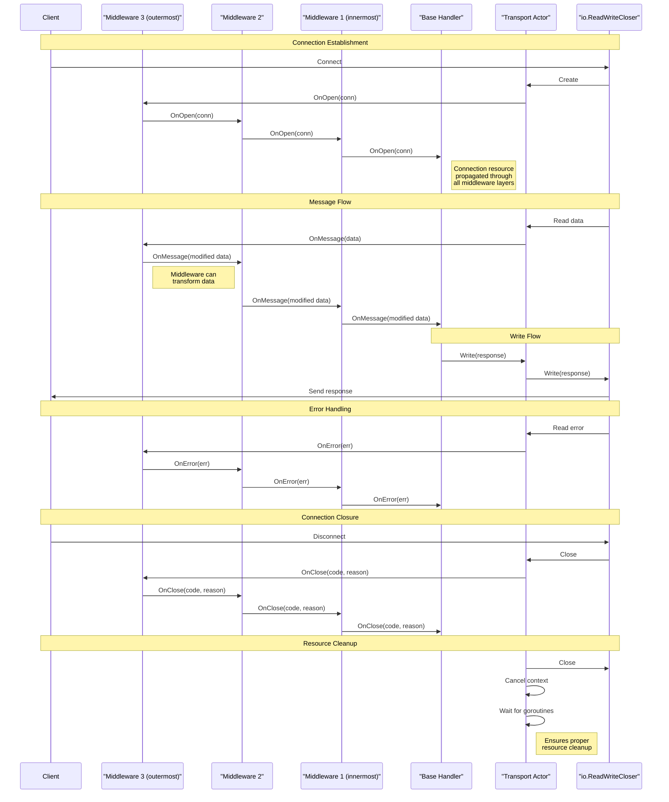

# Go NetKit

A lightweight Go library for building network transport layers with middleware support.

## Overview

Go NetKit provides abstractions for creating network transport handlers with middleware capabilities, similar to how HTTP middleware works in web frameworks. This allows for protocol stacking and separation of concerns when building network applications.

## Features

- **Transport Handler Interface**: Define handlers for network events (open, message, close, error)
- **Middleware Support**: Stack middleware functions to process network operations
- **Error Handling**: Specialized error types for connection closing with status codes
- **Context-aware**: Built with Go's context package for proper cancellation and timeout support
- **IO Integration**: Works with Go's standard io.ReadWriteCloser interface
- **Thread Safety**: Fully thread-safe implementation with proper synchronization
- **Resource Management**: Ensures proper cleanup of goroutines and resources

## Installation

```bash
go get github.com/zodimo/go-netkit
```

## Usage

### Basic Transport Handler

```go
package main

import (
    "context"
    "fmt"
    "io"
    "net"
    netkit "github.com/zodimo/go-netkit"
)

func main() {
    // Create a simple transport handler
    handler := netkit.NewTransportHandler(
        // OnOpen handler
        func(conn io.WriteCloser) {
            fmt.Println("Connection opened")
        },
        // OnMessage handler
        func(message []byte) {
            fmt.Printf("Received message: %s\n", string(message))
        },
        // OnClose handler
        func(code int, reason string) {
            fmt.Printf("Connection closed: %d %s\n", code, reason)
        },
        // OnError handler
        func(err error) {
            fmt.Printf("Error: %v\n", err)
        },
    )

    // Use with a TCP connection
    listener, _ := net.Listen("tcp", ":8080")
    conn, _ := listener.Accept()
    
    // Create transport from connection
    ctx := context.Background()
    transportFunc := netkit.FromReaderWriterCloser(ctx, conn)
    
    // Start handling the connection
    closer := transportFunc(handler)
    defer closer.Close()
    
    // Your application logic here...
}
```

### Using Middleware

```go
package main

import (
    "context"
    "fmt"
    "io"
    "net"
    netkit "github.com/zodimo/go-netkit"
)

func main() {
    // Create base handler
    baseHandler := netkit.NewTransportHandler(
        func(conn io.WriteCloser) { fmt.Println("Connection opened") },
        func(message []byte) { fmt.Printf("Received: %s\n", string(message)) },
        func(code int, reason string) { fmt.Printf("Closed: %d %s\n", code, reason) },
        func(err error) { fmt.Printf("Error: %v\n", err) },
    )
    
    // Create logging middleware
    loggingMiddleware := func(handler netkit.TransportHandler) netkit.TransportHandler {
        return netkit.NewTransportHandler(
            func(conn io.WriteCloser) {
                fmt.Println("[LOG] Connection opened")
                handler.OnOpen(conn)
            },
            func(message []byte) {
                fmt.Printf("[LOG] Message received: %d bytes\n", len(message))
                handler.OnMessage(message)
            },
            func(code int, reason string) {
                fmt.Printf("[LOG] Connection closed: %d %s\n", code, reason)
                handler.OnClose(code, reason)
            },
            func(err error) {
                fmt.Printf("[LOG] Error: %v\n", err)
                handler.OnError(err)
            },
        )
    }
    
    // Apply middleware to handler
    handlerWithMiddleware := loggingMiddleware(baseHandler)
    
    // Use the handler with middleware
    listener, _ := net.Listen("tcp", ":8080")
    conn, _ := listener.Accept()
    
    ctx := context.Background()
    transportFunc := netkit.FromReaderWriterCloser(ctx, conn)
    closer := transportFunc(handlerWithMiddleware)
    defer closer.Close()
    
    // Your application logic here...
}
```

## Error Handling

The library provides specialized error types for handling connection closures:

```go
import netkit "github.com/zodimo/go-net"

// Create a close error
closeErr := netkit.NewCloseError(1000, "Normal closure")

// Check if an error is a close error
if netkit.IsCloseError(err) {
    // Handle close error
}

// Check if a close error is unexpected
if netkit.IsUnexpectedCloseError(err, 1000, 1001) {
    // Handle unexpected close
}

// Convert an error to a close error
if closeErr := netkit.AsCloseError(err); closeErr != nil {
    code := closeErr.Code()
    reason := closeErr.Reason()
    // Handle with code and reason
}
```

## Thread Safety and Resource Management

This library is designed with concurrency in mind:

- **Thread-Safe Handlers**: All handler callbacks are synchronized to prevent race conditions
- **Proper Resource Cleanup**: Goroutines are properly tracked and cleaned up
- **Deadlock Prevention**: Timeout mechanisms ensure resources are released
- **Safe Write Operations**: Connection writes are protected against concurrent access
- **Graceful Shutdown**: Connections close cleanly with proper notification

When closing connections:

```go
// Always ensure proper cleanup by calling Close() on the returned closer
closer := transportFunc(handler)
defer closer.Close()

// The Close() method will:
// 1. Cancel the context
// 2. Close the underlying connection
// 3. Wait for all goroutines to finish (with timeout)
// 4. Ensure OnClose handlers are called exactly once
```

## Middleware Resource Propagation

The following sequence diagram illustrates how resources are propagated through middleware layers:



## Configuration Options

You can customize the transport behavior with configuration options:

```go
// Set a custom buffer size for reading
transportFunc := netkit.FromReaderWriterCloser(ctx, conn, netkit.WithReaderBufferSize(8192))
```

Available options:

- `WithReaderBufferSize(size int)`: Set the buffer size for reading data (default: 4096 bytes)

## Testing

The library comes with comprehensive test coverage:

```bash
# Run all tests
go test -v

# Run tests with race detection
go test -race -v

# Run tests with coverage report
go test -cover -v
```

Test files:

- `transport_test.go`: Tests for the transport functionality
- `errors_test.go`: Tests for error handling
- `middleware_test.go`: Tests for middleware functionality
- `integration_test.go`: Integration tests for multiple components

For testing your own transport implementations, you can create a mock that implements the io.ReadWriteCloser interface:

```go
import (
    "context"
    "io"
    "testing"
    netkit "github.com/zodimo/go-netkit"
)

// MockReadWriteCloser implements io.ReadWriteCloser for testing
type MockReadWriteCloser struct {
    ReadData  []byte
    WriteData []byte
    Closed    bool
}

func (m *MockReadWriteCloser) Read(p []byte) (n int, err error) {
    if len(m.ReadData) == 0 {
        return 0, io.EOF
    }
    n = copy(p, m.ReadData)
    m.ReadData = m.ReadData[n:]
    return n, nil
}

func (m *MockReadWriteCloser) Write(p []byte) (n int, err error) {
    m.WriteData = append(m.WriteData, p...)
    return len(p), nil
}

func (m *MockReadWriteCloser) Close() error {
    m.Closed = true
    return nil
}

func TestMyTransport(t *testing.T) {
    // Create a mock connection
    mock := &MockReadWriteCloser{
        ReadData: []byte("test data"),
    }
    
    // Use the mock with your transport
    ctx := context.Background()
    transportFunc := netkit.FromReaderWriterCloser(ctx, mock)
    
    // Create a handler and use it with the transport
    // ...
}
```

## License

[MIT License](LICENSE)